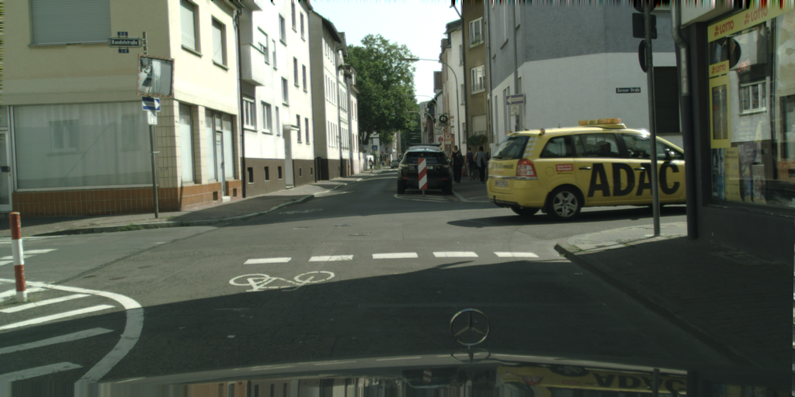
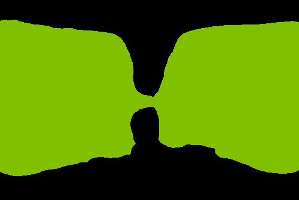
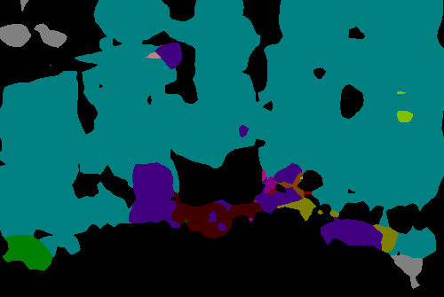
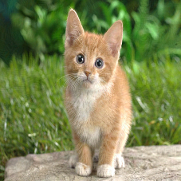

On the Robustness of Semantic Segmentation Models to Adversarial Attacks
==

This code performs the experiments presented in our paper, [On the Robustness of Semantic Segmentation Models to Adversarial Attacks](http://www.robots.ox.ac.uk/~aarnab/adversarial_robustness.html).
The code has been refactored from the version used to perform the experiments in the paper, but should reproduce the results.

If you find this work useful, please cite

```
@inproceedings{arnab_cvpr_2018,
	title={On the Robustness of Semantic Segmentation Models to Adversarial Attacks},
	author={Arnab, Anurag and Miksik, Ondrej and Torr, Philip H. S.},
	booktitle={CVPR},
	year={2018}
}
```

## Installation

The adversarial attacks are implemented in the [Caffe](https://github.com/BVLC/caffe) framework. 
To run the code, Caffe must be installed and ``pycaffe`` should be present in the ``$PYTHONPATH`` environment variable.

## Adversarial attacks

Variants of the FGSM attack, which produces adversarial perturbations with bounded ``l_{infinity}`` norm, are implemented in [`attacks.py`](attacks.py).
The code does not depend on the version of Caffe being used.
Therefore, any fork of Caffe can be used (as long as it is in ``$PYTHONPATH``), allowing many different types of models to be attacked.

## Demos

### Segmentation on Cityscapes

Run ``./examples/demo_cityscapes.sh``. You should see the following in the ``output`` directory which will be created.

|  |  |  |
|:---:|:---:|:---:|
| Input image | Original prediction | Adversarial prediction |

### Segmentation on Pascal VOC

Run ``./examples/demo_voc.sh``.  You should see the following in the ``output`` directory which will be created.

|  |  |  |
|:---:|:---:|:---:|
| Input image | Original prediction | Adversarial prediction |


### ImageNet classification

Run ``../examples/demo_imagenet.sh``. You should see

|  |  | 
|:---:|:---:|
| Original image | Adversarial image |


```
Prediction of original image
[281 282 285 277 287]
n02123045 tabby, tabby cat                                   0.312
n02123159 tiger cat                                          0.238
n02124075 Egyptian cat                                       0.124
n02119022 red fox, Vulpes vulpes                             0.101
n02127052 lynx, catamount                                    0.071

Prediction of adversarial image
[274 272 277 273 278]
n02115913 dhole, Cuon alpinus                                1.000
n02114855 coyote, prairie wolf, brush wolf, Canis latrans    0.000
n02119022 red fox, Vulpes vulpes                             0.000
n02115641 dingo, warrigal, warragal, Canis dingo             0.000
n02119789 kit fox, Vulpes macrotis                           0.000
```

## Running on your own images

You can modify the demo script, or refer to [``opts.py``](opts.py) for the command line arguments that need to be passed to the ``main.py``.
Note the keys which are expected to be in the model definition protoxt, as described next

### Model definitions

The model defintion prototxt should set ``force_backward: true``. This is necessary to compute gradients.
The code assumes that there are nodes in the graph named ``data``, ``label`` and ``output``.
These are the RGB image, the label and logits (not softmax-normalised) predicted by the network.
An example of this is the [here](models/fcn8_voc.prototxt)

## Contact

For any queries, contact anurag.arnab@gmail.com.
Pull requests are also welcome.
